<!-- HEADER -->

  

  

  🚀 Software Engineer @ AYT &nbsp;|&nbsp; 📍 Amman, Jordan &nbsp;|&nbsp; 

  
  
  

---

## 🧠 About Me

- 💼 Software Engineer at **Ahmad Yousef Tarawneh Partners (AYT)** — designing and maintaining production systems used in real day-to-day operations
- 🏗️ I build full-stack systems on **two stacks**: `C# / ASP.NET Core MVC / Entity Framework Core` and `PHP / Laravel / custom MVC`
- 🔐 Security-first mindset: 2FA (TOTP), role-based access control, and per-action activity logging are standard in everything I ship — not afterthoughts
- 🗄️ Comfortable owning a project end-to-end: schema design, backend, frontend, deployment, and server maintenance
- 🤖 Currently exploring how to apply AI meaningfully inside production applications

---

## 🛠️ Tech Stack

**Backend**

  
  
  
  
  
  

**Frontend**

  
  
  
  
  
  

**Database & Tools**

  
  
  
  

---

## 📌 Featured Projects

### 🏆 [AYT Document Control System](https://github.com/Aseel27Yassin/Document-Control-System)
Production-grade internal platform built at **AYT** that **replaced the company's entire Excel-based document register**. Manages projects, correspondence, drawing revisions, and transmittals — with full approval history, automatic overdue-flagging, and a restricted portal for external engineers/consultants who never see the internal admin side.

**Highlights:** custom PHP MVC built from scratch • 2FA (TOTP) for admins • per-action activity logging • configurable roles/permissions • scheduled automated backups (local + off-site) • bilingual English/Arabic UI • Excel-to-system data migration tooling

---

| Project | Description | Stack |
|---|---|---|
| **[ThirtySix-36](https://github.com/Aseel27Yassin/ThirtySix-36)** | Company website for "ThirtySix" showcasing its services |  |
| **[bonfakhraldincart](https://github.com/Aseel27Yassin/bonfakhraldincart)** | E-commerce cart application |   |
| **[Portfolio](https://github.com/Aseel27Yassin/portfolio)** | Personal portfolio site — [live demo](https://aseelyassin-portfolio.netlify.app/) |    |

---

## 📊 GitHub Stats

  
  

  

---

## 👀 Profile Views

  

## 📫 Contact Me

  
  

